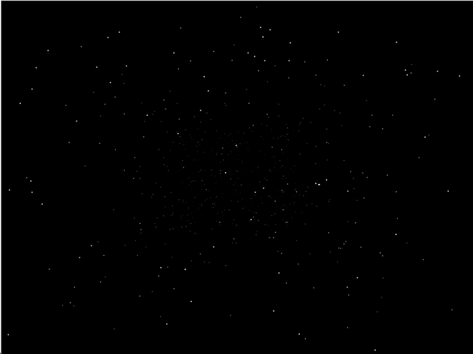

# Star Field — 3D Starfield Simulation in Python

## Overview

**Star Field** is a real-time 3D starfield simulation written in Python, utilizing the Tkinter library for rendering.  
It simulates stars flying towards the viewer, creating a captivating depth and motion effect reminiscent of classic space animations.

This project demonstrates core principles of object-oriented programming (OOP), 3D-to-2D projection, and basic animation in a simple, accessible Python script.

---

## Features

- **3D Star positions** with depth (`z`) influencing size and brightness.  
- **Smooth animation loop** with efficient canvas redraws.  
- **Adjustable star speed** to control the flow of stars.  
- **Real-time star regeneration** when stars move past the viewer to maintain continuity.  
- **Optimized memory usage** using `__slots__` in the `Star` class.  
- Easy to extend and customize for beginners and enthusiasts.

---

## Installation & Requirements

- Python 3.x (Tested with Python 3.8+)  
- Tkinter (Standard Python GUI library, pre-installed with most Python distributions)  

> No external libraries required to run the core simulation.